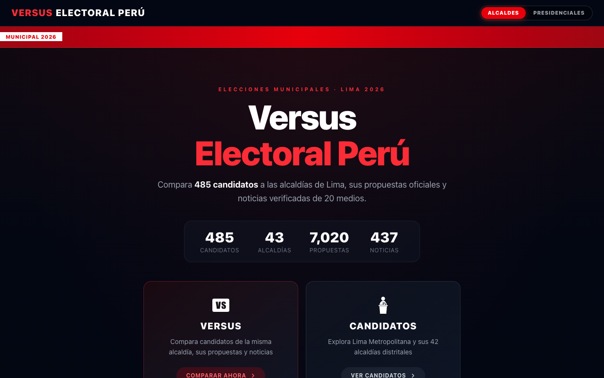

<p align="center">
  <b>🗳️ Versus Electoral Perú</b><br>
  <sub>Compara candidaturas municipales de Lima 2026, sus propuestas oficiales y noticias de fuentes periodísticas.</sub>
</p>

<p align="center">
  
</p>

---

## Qué resuelve

**Versus Electoral Perú** concentra la comparación de candidatos a las alcaldías de Lima, sus planes de gobierno y la cobertura periodística asociada. Ayuda a revisar información pública con contexto y a llegar siempre a la fuente original.

> La clasificación de noticias es automática y orientativa; no reemplaza la presunción de inocencia ni constituye una conclusión legal.

## Funcionalidades principales

- **Comparación cara a cara** de candidaturas de una misma alcaldía.
- **Exploración de Lima Metropolitana y alcaldías distritales**, con candidaturas y propuestas registradas.
- **Monitoreo de noticias** desde más de 20 medios peruanos, con enlace a la publicación de origen.
- **Clasificación contextual asistida por IA** para distinguir menciones relevantes de propuestas, opiniones o críticas.
- **Ingesta de planes de gobierno y fotografías** de candidatos.
- **Actualización programada**: Vercel Cron y GitHub Actions complementan dos ejecuciones diarias.

## Flujo de uso

1. Elegí una alcaldía o abrí el modo **Versus**.
2. Revisá las candidaturas y sus propuestas oficiales.
3. Contrastá las noticias clasificadas y abrí la fuente original para ampliar el contexto.

## Arquitectura y stack

| Capa | Stack |
|------|-------|
| Framework | Next.js 16 (App Router) |
| ORM | Prisma |
| Base de datos | Postgres (Supabase) |
| IA | OpenAI / Anthropic |
| Scraping | Cheerio + axios |
| 3D | Three.js / React Three Fiber |

Las páginas se regeneran cuando el cron incorpora información nueva; el TTL diario funciona como red de seguridad. La aplicación mantiene la capa web, la ingesta y Prisma en el mismo repositorio.

## Instalación y ejecución local

```bash
npm install
cp .env.example .env
npm run db:migrate:dev
npm run db:seed
npm run dev
```

Abrí [http://localhost:3000](http://localhost:3000).

## Variables de entorno

| Variable | Uso |
|----------|-----|
| `DATABASE_URL` | Conexión Postgres mediante pooler para serverless |
| `DIRECT_URL` | Conexión directa para migraciones |
| `CRON_SECRET` | Protege el endpoint `/api/cron` |
| `SCRAPE_API_KEY` | Protege `/api/scrape` |
| `OPENAI_API_KEY` / `OPENAI_MODEL` | Clasificación con IA (opcional) |

## Operación y scripts

El cron principal está configurado en `vercel.json` para `/api/cron`; `.github/workflows/cron-midday.yml` agrega una segunda ejecución diaria en el plan Hobby. El endpoint valida `Authorization: Bearer <CRON_SECRET>`.

```bash
npm run scrape                    # scraping manual vía /api/scrape
npm run cron                      # scraping local por script
npm run db:migrate:deploy         # migraciones en producción
npm run db:seed                   # datos semilla de candidatos
npm run ingest:planes-municipales # planes de gobierno
npm run ingest:fotos-municipales  # fotos de candidatos
npm run check:isr                 # presupuesto de regeneración ISR
```

## Estructura relevante

```text
src/app/        rutas y pantallas del App Router
src/components/ componentes de comparación y visualización
src/lib/        acceso a datos, scraping, clasificación y catálogos
prisma/         esquema, migraciones y datos semilla
scripts/        ingestas, cron local y generación de manifiestos
public/         iconos, fotos y recursos estáticos
```

---

<p align="center"><sub>Hecho con ❤️ por <a href="https://github.com/anthoniriv">Anthoni Rivera</a></sub></p>
